# GetInTouch Android

Android client for **GetInTouch**, a full-stack application designed to help employees connect with colleagues in a new workplace or organization.

## Overview

The Android application allows employees to:

- Browse colleagues within their organization
- View profile information such as department, hobbies, and social links
- Edit their own profile
- Upload a profile picture
- Send and receive pokes
- Receive push notifications
- Authenticate securely using JWT

## Features

### Authentication
- Login
- Signup via invitation link
- Persistent user session

### Member
- Browse colleagues
- View detailed member profiles
- Edit personal profile
- Upload profile picture
- Send pokes
- Receive notifications

### Admin
- Manage departments
- Invite new members

## Tech Stack
- Kotlin
- Jetpack Compose
- MVVM Architecture
- Kotlin Coroutines
- REST API
- Firebase Cloud Messaging (FCM)
- Coil
- Material 3

## Architecture

```text
UI (Jetpack Compose)
        │
    ViewModel
        │
   Repository
        │
  Custom API Client
        │
 REST Backend API
```

## Backend Repository

The backend REST API for this application is available here:

https://github.com/nicojonathan/getintouch-backend

# Screenshots

## Admin

<table>
  <tr>
    <td align="center">
      <b>Signup</b><br>
      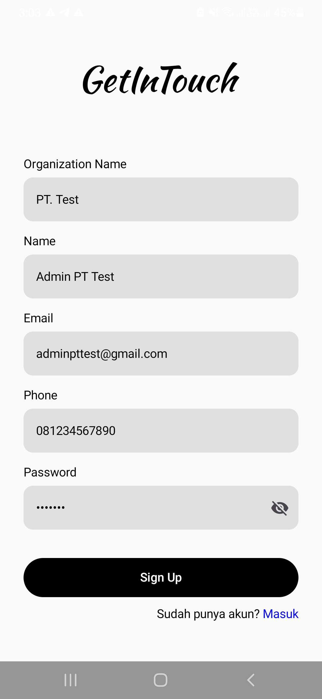
    </td>
    <td align="center">
      <b>Login</b><br>
      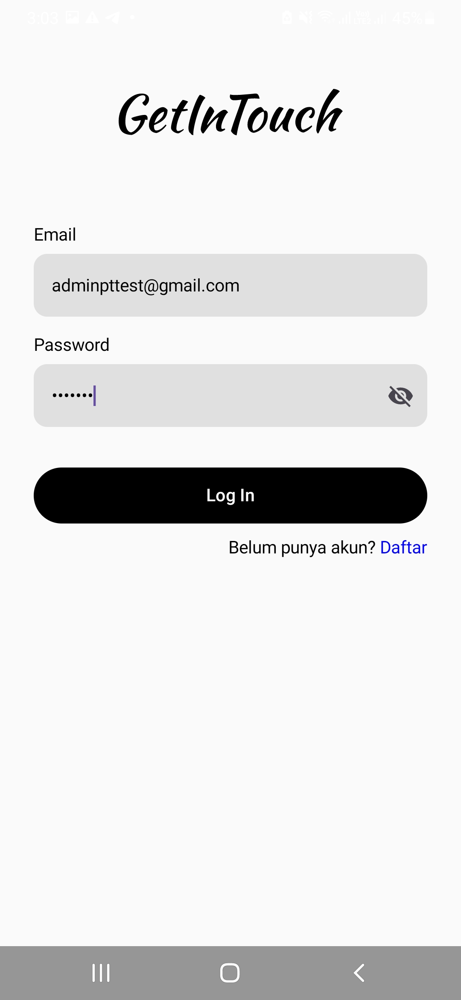
    </td>
    <td align="center">
      <b>Menus</b><br>
      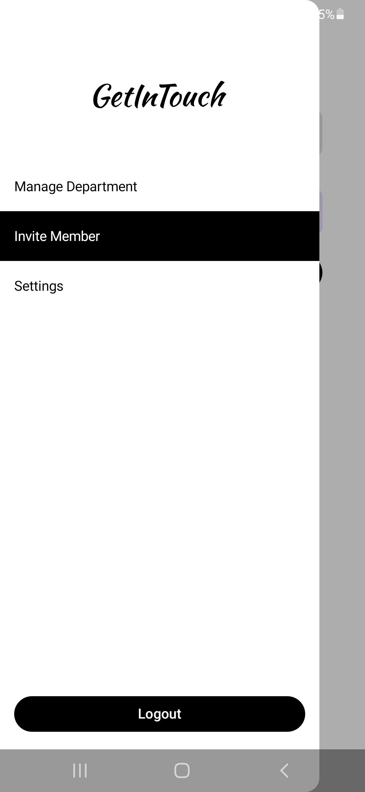
    </td>
  </tr>

  <tr>
    <td align="center">
      <b>Manage Department</b><br>
      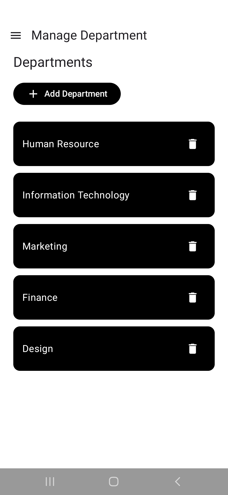
    </td>
    <td align="center">
      <b>Invite Member</b><br>
      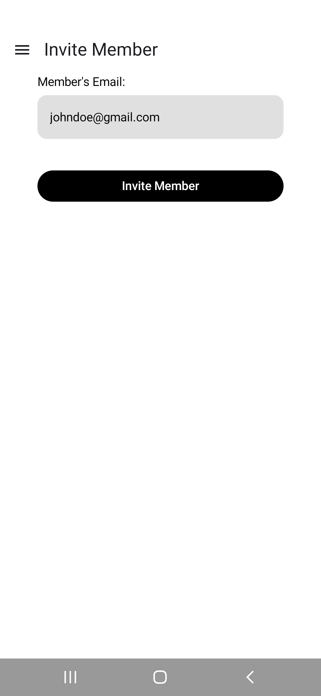
    </td>
    <td align="center">
      <b>Invitation Link</b><br>
      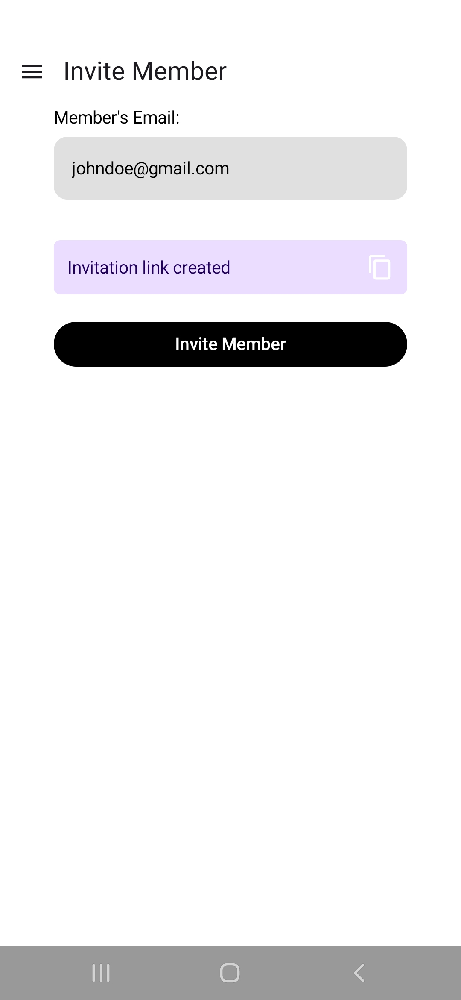
    </td>
  </tr>
</table>

## Member

<table>
  <tr>
    <td align="center">
      <b>Signup</b><br>
      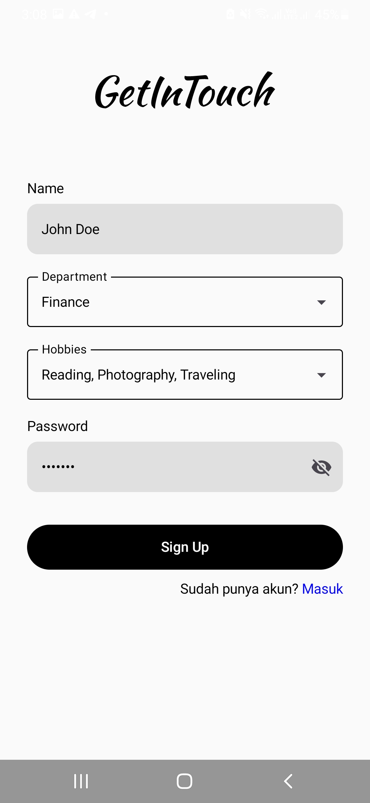
    </td>
    <td align="center">
      <b>Login</b><br>
      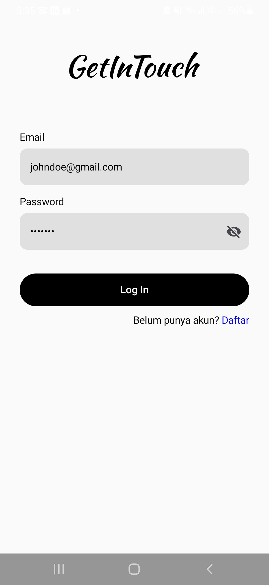
    </td>
    <td align="center">
      <b>Home</b><br>
      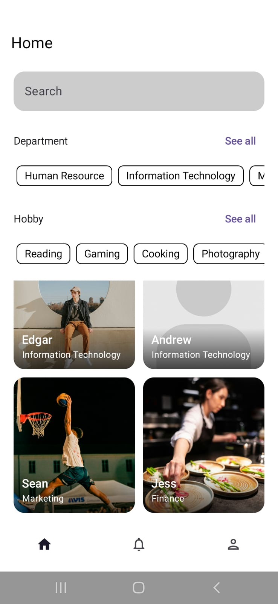
    </td>
  </tr>

  <tr>
    <td align="center">
      <b>Profile</b><br>
      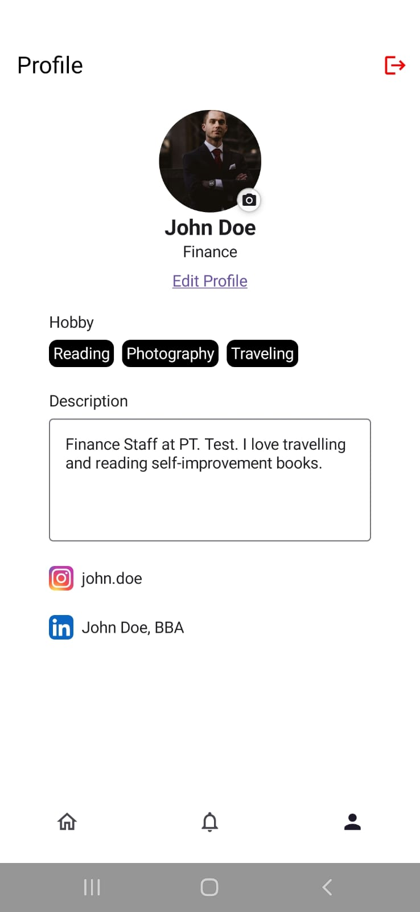
    </td>
    <td align="center">
      <b>Edit Profile</b><br>
      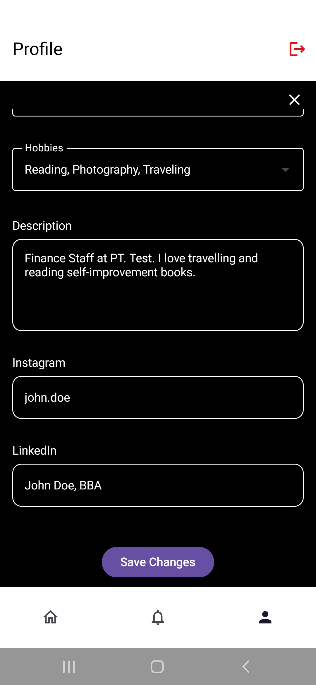
    </td>
    <td align="center">
      <b>Say Hi</b><br>
      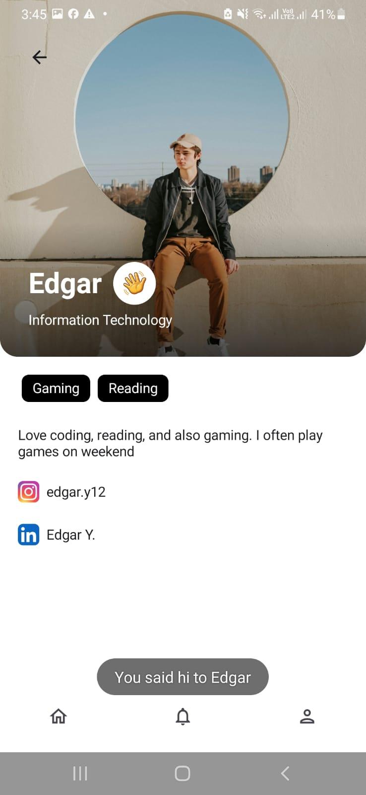
    </td>
  </tr>

  <tr>
    <td align="center">
      <b>Push Notification</b><br>
      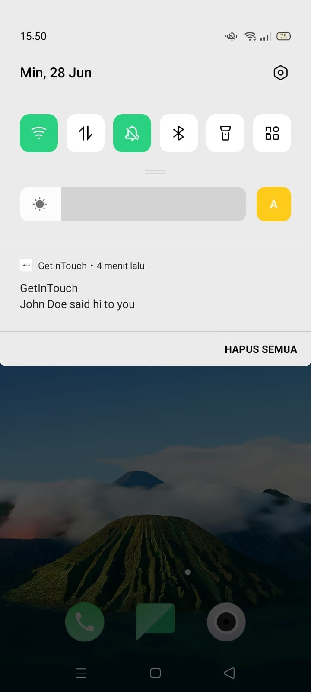
    </td>
    <td align="center">
      <b>App Launcher Notification</b><br>
      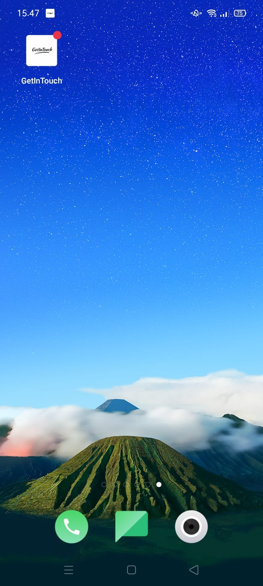
    </td>
    <td align="center">
      <b>Notifications</b><br>
      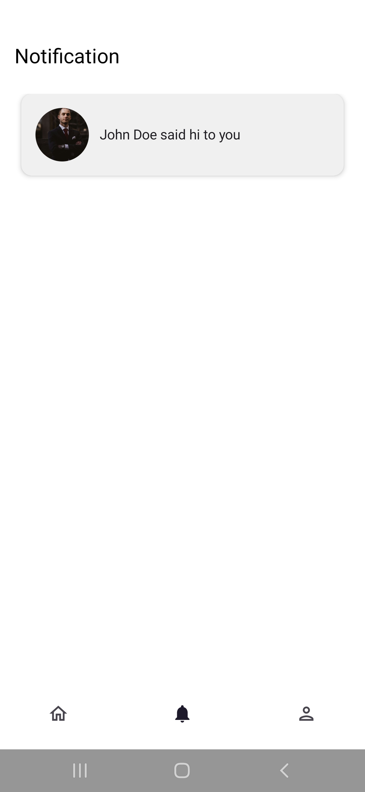
    </td>
  </tr>
</table>
